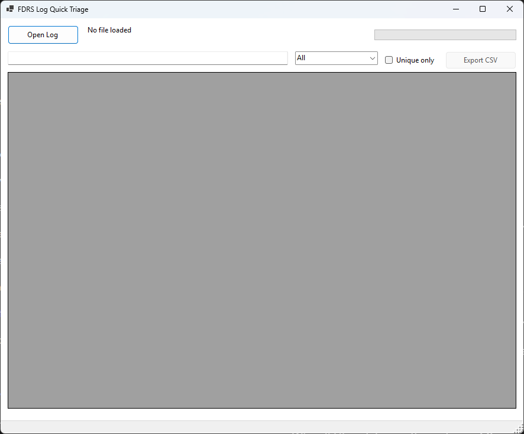
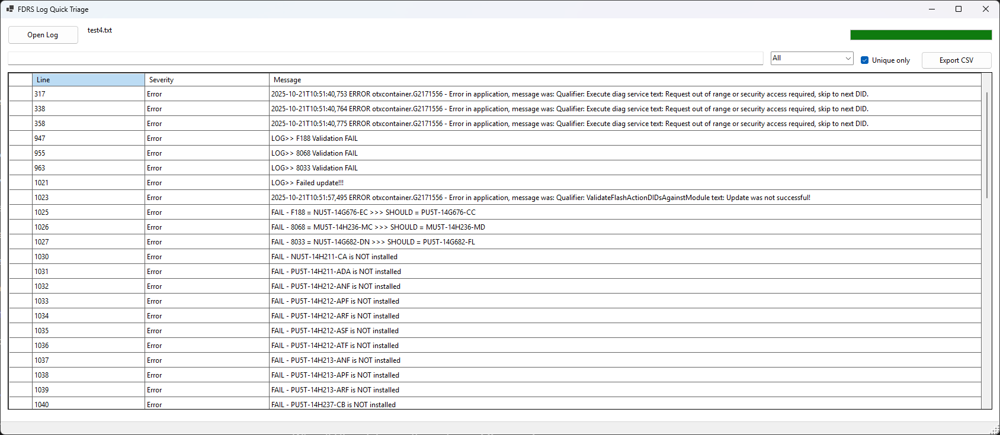
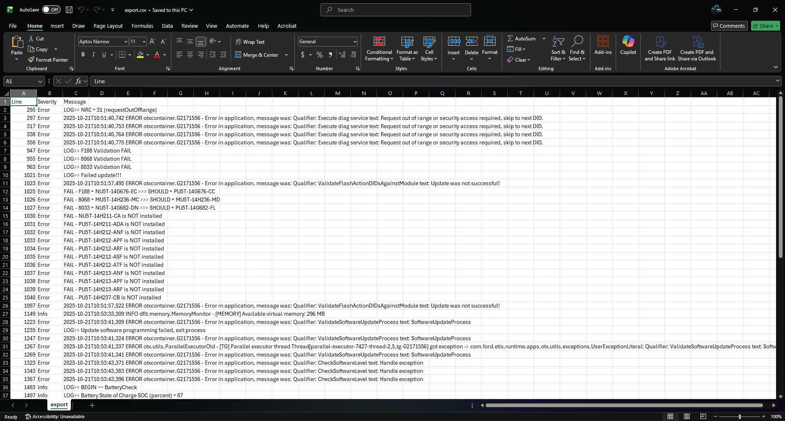

# FDRS Log Quick Triage

A Windows Forms (.NET) desktop utility designed to rapidly triage **Ford Diagnostic & Repair System (FDRS)** log files by extracting high-signal entries, classifying severity, filtering results in real time, and exporting actionable findings to CSV.

This project was built to reflect **real automotive engineering and cybersecurity workflows**, where large, noisy logs must be triaged quickly, accurately, and defensibly.

---

## 🔍 Project Overview

FDRS logs can contain thousands of lines, many of which are irrelevant during initial triage.  
This tool focuses on **speed, clarity, and decision support** by:

- Surfacing only high-value diagnostic lines
- Automatically classifying severity
- Allowing rapid filtering without modifying raw data
- Exporting evidence suitable for documentation or escalation

---

## 🧑‍💼 Engineering Context & Operational Relevance

In automotive, cybersecurity, and embedded systems environments:

- Logs are **large, noisy, and time-sensitive**
- Engineers must:
  - Identify faults quickly
  - Reduce cognitive load
  - Justify decisions with evidence

This project demonstrates how to:

- Design tooling that **extracts signal from noise**
- Preserve raw data integrity while enabling fast analysis
- Build UI utilities that support **engineering decision-making**, not just display

The same patterns apply directly to:

- ECU diagnostics
- SOC alert triage
- Telemetry analysis
- Incident response tooling

---

## 🧠 Technical Highlights

### Architecture & Design Choices

- **Event-Driven WinForms Architecture**
  - Explicit, controlled event wiring
- **Single Render Pipeline**
  - All UI updates flow through one method (`ApplyFilter`), ensuring consistent state, predictable behavior, and easy extensibility.
- **Immutable Master Dataset**
  - Extracted log data is never mutated by filters
- **Defensive UI Design**
  - Prevents duplicate handlers and inconsistent state
- **Manual Layout Management**
  - Predictable resizing and control placement

---
## 🔍 Code Design Deep Dive

### Single Render Pipeline
The application uses a single rendering method (`ApplyFilter`) that rebuilds the UI view from an immutable master dataset.  
This avoids UI state drift, prevents filter interactions from corrupting data, and ensures that export behavior always matches what the user sees.

### Immutable Master Dataset
Extracted log entries are stored once and never mutated by filtering operations.  
All filters operate on views, not the underlying data, preserving raw log integrity.

### Explainable Severity Classification
Severity classification is implemented using transparent, keyword-based heuristics rather than opaque scoring models.  
This allows engineers to easily audit, tune, and justify classification decisions.

### Efficient Deduplication
Duplicate log messages are removed using a case-insensitive HashSet, ensuring O(1) lookup performance while collapsing noisy repeat faults into distinct failure modes.

### Defensive WinForms Lifecycle Management
Dynamic UI elements are created deterministically during construction to avoid layout lifecycle issues common in WinForms applications.  
Manual layout logic ensures predictable resizing and control alignment across window sizes.

---

## ⚙️ Core Functionality

- Load `.txt` diagnostic log files
- Extract relevant lines using keyword-based regex matching
- Automatically classify entries by severity:
  - **Error**
  - **Warning**
  - **Info**
- Real-time filtering:
  - Text search
  - Severity dropdown
  - Unique-only toggle
- Export filtered results to CSV
- Read-only results grid to preserve log integrity

---

## ⚠️ Severity Classification Logic

Severity is determined using explainable, keyword-based heuristics:

| Severity | Matching Keywords |
|--------|------------------|
| Error | `error`, `fail`, `nrc`, `denied` |
| Warning | `warning`, `timeout`, `voltage` |
| Info | Default fallback |

These rules are intentionally simple, transparent, and easy to tune for real FDRS data.

---

## 📤 CSV Export

- Exports **only currently visible (filtered)** rows
- Honors all active filters and uniqueness settings
- CSV-safe quoting for commas and quotes

Example output:
```csv
Line,Severity,Message
248,Error,"Voltage out of range detected"
```

## 🖥️ User Interface Overview

### 1) Application Startup (No Log Loaded)
Initial state before a diagnostic log is opened.



---

### 2) Parsed Diagnostic Log (All Entries)
Full diagnostic log loaded and parsed, showing all detected entries.


---

### 3) Info-Level Filtering
Severity filter set to **Info**, isolating non-error operational messages.


---

### 4) Security / Access-Related Errors
Filtered view highlighting security access issues, NRC errors, and restricted diagnostic responses.


---

### 5) Unique-Only Error View
Duplicate errors collapsed to expose distinct failure modes.



---

### 6) CSV Export Output
Filtered results exported for documentation, escalation, or reporting.




## 🚀 How to Run

1. Open the solution in **Visual Studio**
2. Build the project
3. Run the application
4. Click **Open Log**
5. Apply filters as needed
6. Export results to CSV


## 📄 License

MIT License

---

## 👤 Author

**Harold Watkins**  
SOC Analyst • Automotive Cybersecurity • Embedded Systems Engineering  
Ford SVT Analyst  
GitHub: https://github.com/LRTechpro
