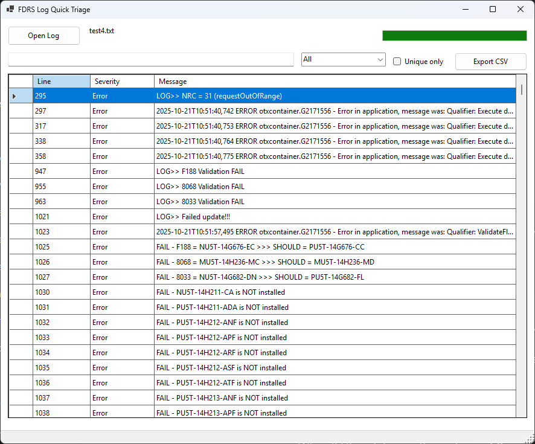
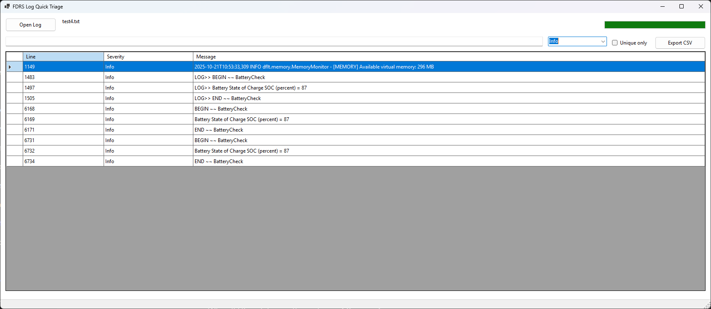
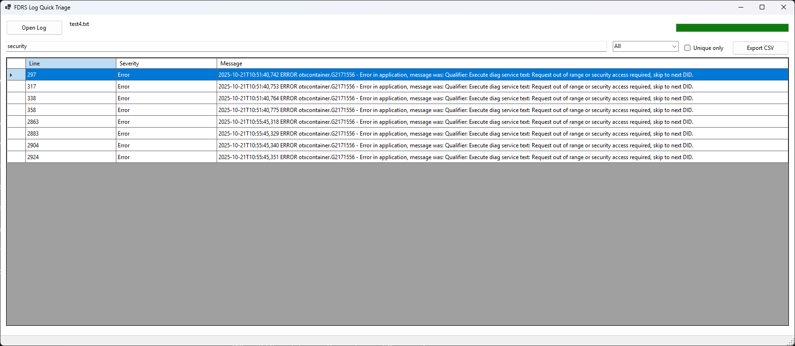

# FDRS Log Quick Triage

A Windows Forms (.NET) desktop utility designed to rapidly triage **Ford Diagnostic & Repair System (FDRS)** log files by extracting high-signal entries, classifying severity, filtering results in real time, and exporting actionable findings to CSV.

This project was built to reflect **real automotive engineering and cybersecurity workflows**, where large, noisy logs must be triaged quickly, accurately, and defensibly.

---

## 🔍 Project Overview

FDRS logs can contain thousands of lines, many of which are irrelevant during initial triage.  
This tool focuses on **speed, clarity, and decision support** by:

- Surfacing only high-value diagnostic lines
- Automatically classifying severity
- Allowing rapid filtering without modifying raw data
- Exporting evidence suitable for documentation or escalation

---

## 🧑‍💼 Why This Matters (Engineering Perspective)

In automotive, cybersecurity, and embedded systems environments:

- Logs are **large, noisy, and time-sensitive**
- Engineers must:
  - Identify faults quickly
  - Reduce cognitive load
  - Justify decisions with evidence

This project demonstrates how to:

- Design tooling that **extracts signal from noise**
- Preserve raw data integrity while enabling fast analysis
- Build UI utilities that support **engineering decision-making**, not just display

The same patterns apply directly to:

- ECU diagnostics
- SOC alert triage
- Telemetry analysis
- Incident response tooling

---

## 🧠 Technical Highlights

### Architecture & Design Choices

- **Event-Driven WinForms Architecture**
  - Explicit, controlled event wiring
- **Single Render Pipeline**
  - All UI updates flow through one method (`ApplyFilter`)
- **Immutable Master Dataset**
  - Extracted log data is never mutated by filters
- **Defensive UI Design**
  - Prevents duplicate handlers and inconsistent state
- **Manual Layout Management**
  - Predictable resizing and control placement

---

## ⚙️ Core Functionality

- Load `.txt` diagnostic log files
- Extract relevant lines using keyword-based regex matching
- Automatically classify entries by severity:
  - **Error**
  - **Warning**
  - **Info**
- Real-time filtering:
  - Text search
  - Severity dropdown
  - Unique-only toggle
- Export filtered results to CSV
- Read-only results grid to preserve log integrity

---

## ⚠️ Severity Classification Logic

Severity is determined using explainable, keyword-based heuristics:

| Severity | Matching Keywords |
|--------|------------------|
| Error | `error`, `fail`, `nrc`, `denied` |
| Warning | `warning`, `timeout`, `voltage` |
| Info | Default fallback |

These rules are intentionally simple, transparent, and easy to tune for real FDRS data.

---

## 📤 CSV Export

- Exports **only currently visible (filtered)** rows
- Honors all active filters and uniqueness settings
- CSV-safe quoting for commas and quotes

Example output:
```csv
Line,Severity,Message
248,Error,"Voltage out of range detected"

## 🖥️ User Interface Overview

### Application Startup (No Log Loaded)


### Parsed Diagnostic Log


### Info-Level Filtering


### Security-Related Errors


### Unique-Only Error View


### CSV Export Output


## 🚀 How to Run

1. Open the solution in **Visual Studio**
2. Build the project
3. Run the application
4. Click **Open Log**
5. Apply filters as needed
6. Export results to CSV


## 📄 License

MIT License

---

## 👤 Author

**Harold Watkins**  
SOC Analyst • Automotive Cybersecurity • Embedded Systems Engineering  
Ford SVT Analyst  
GitHub: https://github.com/LRTechpro
